# Divergent Design

## BloomScout

The intent of this app is to show users that nature is very accessible and to help bring back childhood wonder associated with nature. Through easy identification of animals and plants, and making it easier to find them, hopefully the app will help nurture curiosity in its users. The intended audience will be any curious person of the age of a young teen or older. 

### Comparables:

There were three main apps that served as great comparables for my vision. These are íNaturalist, Seek and Pokemon Go. These three apps have plenty of features that could be included in my app to make connecting with nature exciting and fun. 

##### íNaturalist 
is an online social network and citizen science project that allows users to share observations of biodiversity worldwide. It’s a platform where people can document and share their sightings of plants, animals, fungi, and other organisms, contributing to a growing database of global biodiversity data.

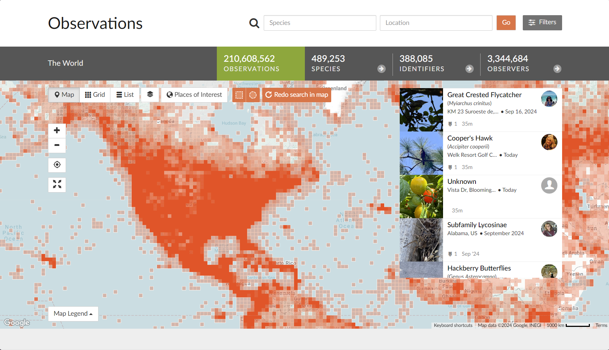

One of the key features is a global map that shows observations from all over the world. 

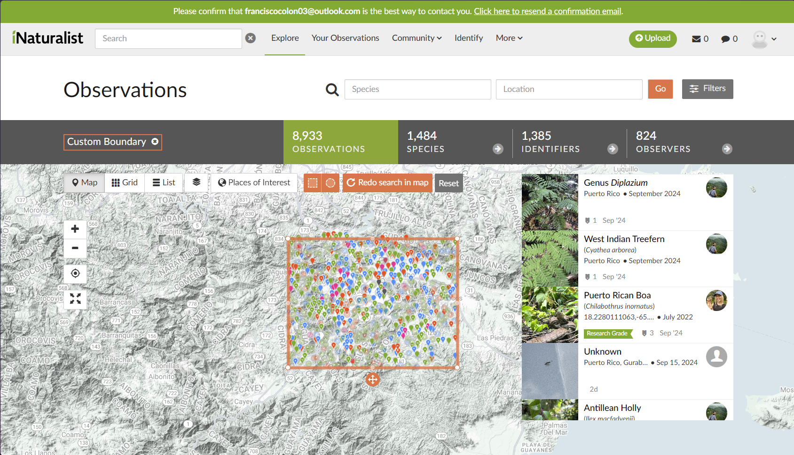

You can select specific areas on the map to narrow down specific observations. At first the map was very overstimulating, this feature that allows selecting specific areas is quite a good remedy but the area selected in of itself is still very overstimulating. Maybe adding a filter that can exclude older observations could help remedy this issue. 

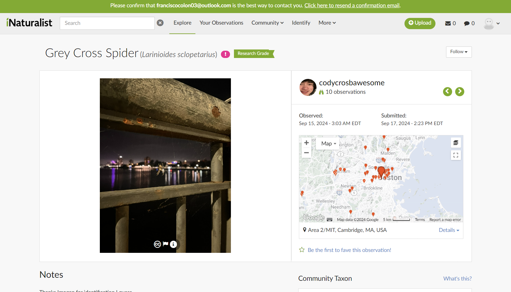

Clicking on an organism on the right hand side leads you to this page. Here I selected a spider that I have recently seen along the Harvard Bridge which really spooked me the first time I saw it. I remember vividly walking into a huge spider web where these spiders were living. I was very nervous of getting stung but reading through the Spider’s description, it told me that it's bite’s intensity lies somewhere between a mosquito and bee, which I guess gave me some comfort. 

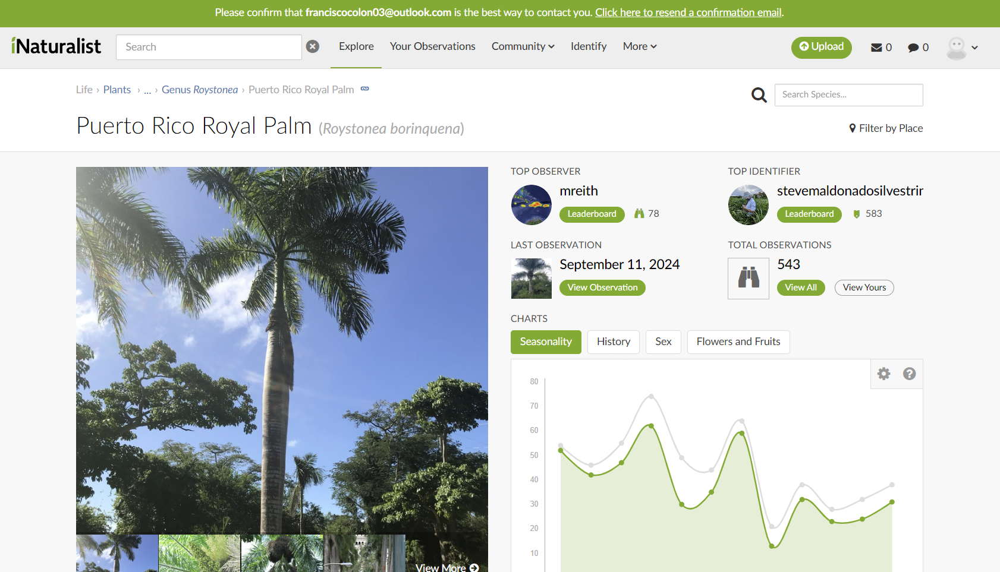

I decided to search up organisms that live in my home town in Puerto Rico by using the map and I found out that we have a native palm tree. I always thought that the palm trees present in Puerto Rico were species from other places but I was very glad to learn this is not the case.
Uploading my own observations was also very easy. Below I show what it looks like to upload a hermit crab I found on the Llanos Costa beach of Cabo Rojo in Puerto RIco.

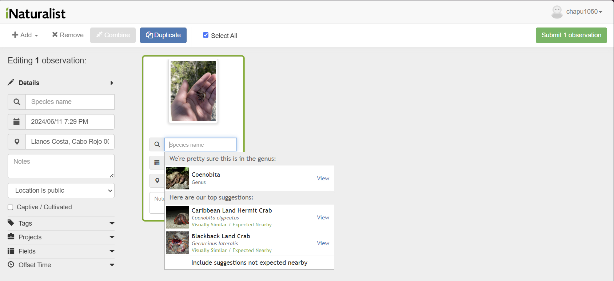

The biggest issue with identifying organisms is just not knowing what they are but íNaturalist solves this by running the images through a computer vision model. Organisms included in the model have this fancy badge in their info page:

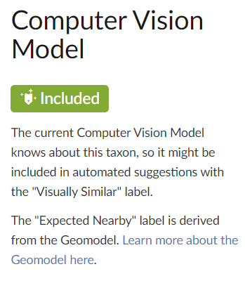

This tech made uploading organisms very easy and also let me know exactly which organism I was looking at. 

##### Seek by íNaturalist
is a mobile app designed to make identifying plants, animals, fungi, and other living organisms easy and fun. It's built on the same foundation as íNaturalist but tailored more for casual users, families, and beginners. This app feels like a “diet” version of íNaturalist.

The most notable feature of this app is a real time identification feature which uses the smartphone’s camera. This feature is shown in the following gif: (imagine the brown bear stuffed plush is actually an alpaca.)

It appears to use the same model íNaturalist uses in real time. The real time application of the machine is a very impressive feature that I see many uses for. Once the organism is identified, you can click the shutter button to take a picture which is saved onto the device and then it records it automatically as an observation in a similar way to íNaturalist. This observation however is saved only to the user’s account and is not uploaded anywhere else.

##### Pokemon Go 

is an augmented reality (AR) mobile game developed by Niantic in collaboration with The Pokemon Company. Released in 2016, it became a global phenomenon by combining location-based technology with gameplay inspired by the Pokemon franchise, where players capture virtual creatures called Pokemon.

While the game focuses on virtual critters, there are some features that we can also draw inspiration from. 
The game’s main menu is a map view of where the player currently is. 

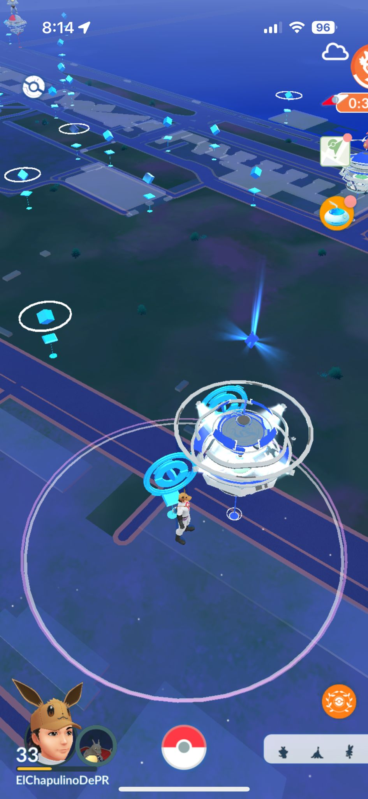

The light blue spots are PokeStops where the player can get items and the big Blue structure is a Pokemon Gym. The gray bar on the lower right side can be clicked to show a list of nearby activities, including Pokemon, PokeStops, and routes. 

Routes seem very interesting. They are paths players can walk through and they are also crowdsourced. If you walk close to the starting or end point of a route, a user can begin walking it. The user will be shown an altitude map of the route and its distance.  

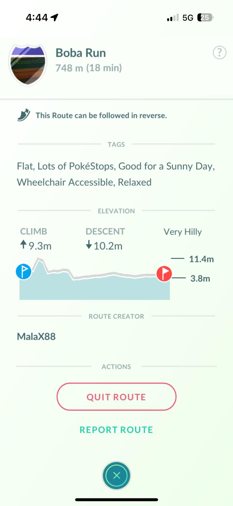

After starting the route, the route path will show up as an overlay on the main menu.

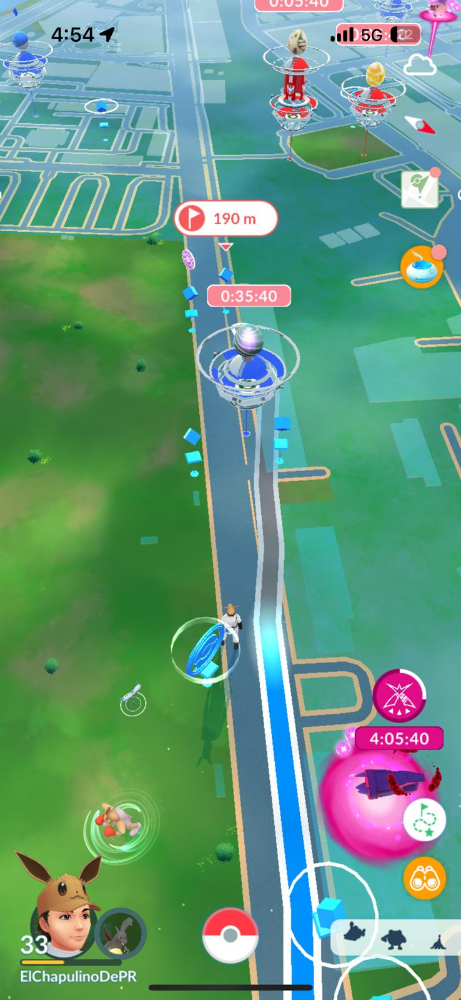

It takes the form of a blue to gray gradient where the blue represents the section of the route walked. During the route the player will be able to spot an increased number of Pokemon which can be captured. 

Also note that green areas such as Briggs field appear differently on the map. 

Upon completing a route, the player is awarded with a badge pertaining to that route which can be shown off to others and they will also be able to exchange a gift that was left at the route. 

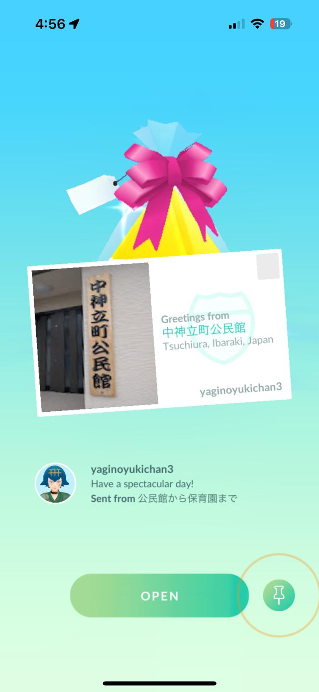

I received a postcard from Japan which I exchanged for one I had from Barcelona, Spain. This means the next user to use the route will be able to exchange a gift and take the one I left from Barcelona. I really like the sense of community I got from walking this route and I hope I can instill that sense with a similar feature. 

### Prospective features Brainstorm:

1. Map: I believe some sort of map should be added to the app, perhaps similar to Pokemon Go where it's mostly local but it also allows you to zoom out and see the rest of the world.
2. Routes: Similar to routes in Pokemon Go, users can upload their own routes and once verified, they will be public to everyone.
3. Organism recordings: Instances of organisms around the world can be uploaded to an observations page similar to íNaturalist. These organisms can be found on the map.
4. Organism time filtering: While all organisms one has recorded will be visible on their page, the map will only showcase those that have appeared recently. This might push people to actually look for the organism in real life. Flora could appear permanently as plants and trees do not really move but there can be other methods to do this.
5. Gift giving: I found the gift giving feature in Pokemon Go to foster a sense of community among its players. Having players earn postcards at ends of routes or after observing organisms and interchanging them might help foster this sense of community as well.
6. Organism identification: We could perhaps use the íNaturalist API which allows us to use their organism identification model to our advantage. If any organism is not able to be identified by this model we could still let users upload their observations with a picture, but other users will also have the chance to edit the observation and rectify it.
7. Regional Feed: While not really explored in the comparables app, having an Instagram-like feed but sorted by regions or geography in some way could also help foster that sense of community and also show users cool things spotted nearby.
8. Friends/Followers: Allow users to also have friends or followers or some sort of similar feature so that they can keep track of interested accounts in an easier and more intuitive fashion.
9. Party Feature: Let friends and other users group together in parties so that they can walk a route together and/or sync up in recordings.
10. Badges: Let users collect badges upon completing routes or identifying organisms which could be used to show off.
11. Find Organism feature: This will let users find where the closest instance of a specific organism is.
12. Park mapping and other structure: We can use the OpenStreetMap API to locate parks and other structures and have them show up on the map similar to green areas in Pokemon Go.
13. Avatars: In Pokemon Go, users can identify others by username and avatars. I remember recognizing certain individuals over MIT campus which made the game feel more alive. Perhaps adding a similar avatar feature could help others recognize certain local users and make the app feel more dynamic. It does not have to be as high-definition as a Pokemon Go avatar.
14. Photobook/Scrapbook: The recordings page could take the appearance of a photobook. Users will be able to place pictures and add notes to their photobook. Photos taken by other users in the same party will also be available to place. Adding badges and other things the user has earned can also help make an individualized photobook.
15. Credibility metric: By correctly identifying organisms that the user themselves have posted or by helping others identify organisms, they could see an increase in some sort of credibility score. This can also be rewarded by badges.
16. Ownership of organisms?: If an organism is a pet or if it's a plant in one’s property, add that as a tag somehow.
17. Fruit tastiness: If there is a fruit or berry-bearing tree (which is edible) and it is on public property, add a section where users can review the taste of the fruit and share with others.
18. What can be found close by: Add a field to the map which will let users know what organisms can be found nearby regardless if they have been logged on the app or not. If pigeons are found in a certain park but they have not been logged in a while, it will be shown in this field.
19. Stickers: Parks, zoos, and other localities can upload their own stickers which can be collected by users if they visit in real life. These stickers can be attached to postcards/gifts or the scrapbook.
20. Photo database: Save recent photos of organisms onto the map and also allow users to find those photos if they search for the organism in the picture.

### VSD Analysis:

1. __Variation in Human ability:__ The app itself is very tied into some form of physical activity which means most users accept the risks that come with different abilities, however, this does not mean we can not make features that help make routes and nature more accessible to all. Such features could be tags that mention the obstacles one will face on a route, such as stairs or uneven terrain. This could also come with a skill level rating for routes which can inform if one is for your casual user on a walk or for a more hardcore hiker. We can also add a voiceover option and a large button mode for those that need it.
2. __Non-targeted use:__ Nefarious users might place recordings and routes to lure in users to undesirable locations. A very basic feature that could be used to remove malicious users is a reporting function. To target fake recordings, we could have a feature to only allow users to upload pictures taken in the moment from the app, and not pictures saved in the library. Since the pictures taken from the app are unedited, their location data is unchanged and can be used to verify the photo. We can also have new routes go through verification with a volunteer program. Credible Volunteer users can access routes before they are made public and verify if they are appropriate. 
3. __Diverse Geographies:__ A challenge that is very difficult to handle are the diverse geographies that users might experience. More urban places might experience lack of routes and more barren places can experience lack of certain organisms. Allowing parks, museums, zoos and aquariums might help urban places but I honestly do not know what could be used to make users located in barren places have a better experience. We could integrate features that tell users of the closest instance of a park, museum, zoo or aquarium in hopes of making them more accessible.
4. __Reappropriation:__ This app could have considerable use for scientists and researchers in a similar way that íNaturalist does. íNaturalist does an excellent job of including features specifically tailored for research which we could take inspiration from. It could perhaps also be used by runners and athletes to mark down their favorite running/jogging routes and make them public. We could perhaps add tags associated with different activities to routes such as running, cycling, kayaking or off-road driving to encourage use of natural routes outside of just walking and identifying organisms. 
5. __Children use:__  The app might draw in the curiosity of children so it is important to make sure their use of the app is safe. We can limit use of certain features to children by including age verification. If the user has not done age verification or they are too young, we will consider the user a child user. This will come with limitations such as not being able to make public recordings, not being able to access social media features and only being able to see low difficulty, accessible routes. 

### Use sketches:

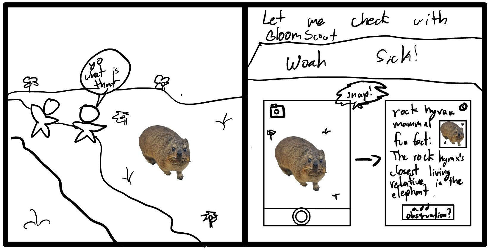
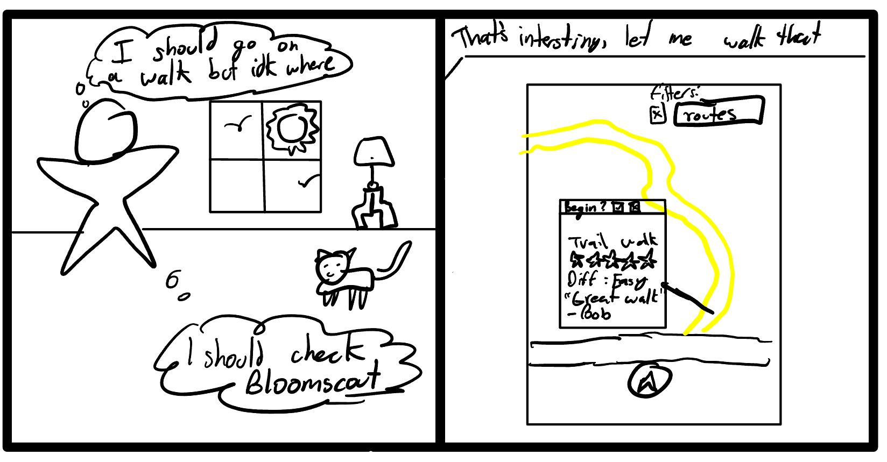
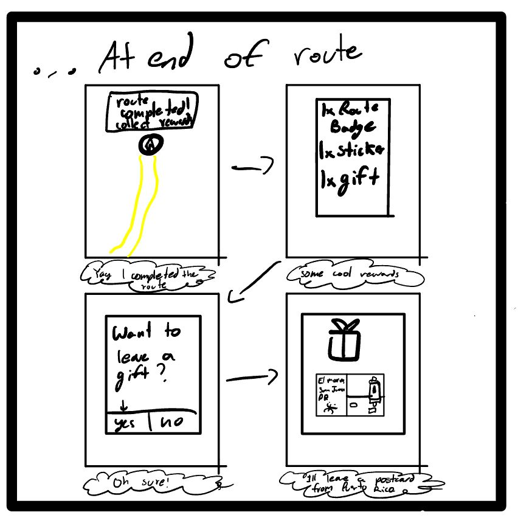